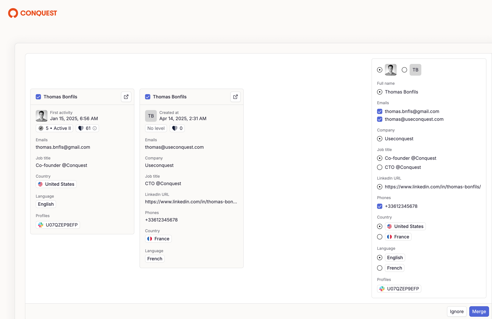

<Update label="2025-06-13">

# CSV Import & Custom Fields 

Now import a CSV file to enrich existing member profiles or create new ones.

During import, you can also **create custom fields**. They will be automatically added to member and company page.

Add more information to a member or company page using custom fields in the form of text, number, date, select, or multi-select.

</Update>

<Update label="2025-04-15">

<Frame>
    
</Frame>

 

# Merge Suggestions

In Conquest, the structure is simple:

- A **member** is one person in your community.
- A **profile** is one identity from a specific platform (Discord, GitHub, etc.)

A single member can have multiple profiles, one per integration.

---

## Why does it matter?

Because **1 member = 1 person**.

To understand your member behavior and journey, you need to have all his information and activities in one place - one unified view of your member profile. 

Once you connect multiple integrations to Conquest (Discord, GitHub, Livestorm...), it’s common for the same person to appear more than once. Each platform creates a separate member with its own profile.

**Example:**

Thomas might appear three times:

- One member with a Discord profile
- One member with a Livestorm profile
- One member with a GitHub profile

But in reality, it’s the same person. **You need to merge these profiles into a single member.**

---

## How does it work?

Every hour or when a new member is created manually, Conquest scans your workspace to detect potential duplicates.

Matching is based on:

- Email
- Full name
- Usernames (for example, `Thomasbnfls` on both Discord and GitHub)

When a match is detected, a merge suggestion is automatically generated.

It’s up to you to confirm or ignore the merging suggestion.

You stay in control. 

When reviewing a merge suggestion, you can:

- Select or deselect individual members to include in the merge
- For multi-value fields like emails, phone numbers, and tags, Conquest will merge all values. You can remove any entries that aren’t relevant.
- For single-value fields like name, avatar, job title, company, or LinkedIn URL, you’ll need to choose one value to keep.

This gives you a clean, consolidated member profile with only the information that matters to you.

---

## Improvements

- You can now manually merge members directly from the members table. Select the members you want to merge. The action bar will appear at the bottom. Click “Merge” and choose which data to keep
- It’s now possible to add the same activity to multiple members. Select the members and add the activity in one go
- The member sidebar has been redesigned. Information is now displayed vertically for better readability. Unnecessary clicks have been removed, especially when adding an email or phone number
- You can now remove a profile from a member if there was a mistake or if you no longer want it linked (for example, duplicates or inactive accounts)
- You can hide and reorder columns in both the members and companies tables
- You can now rename your workspace and change its URL

</Update>